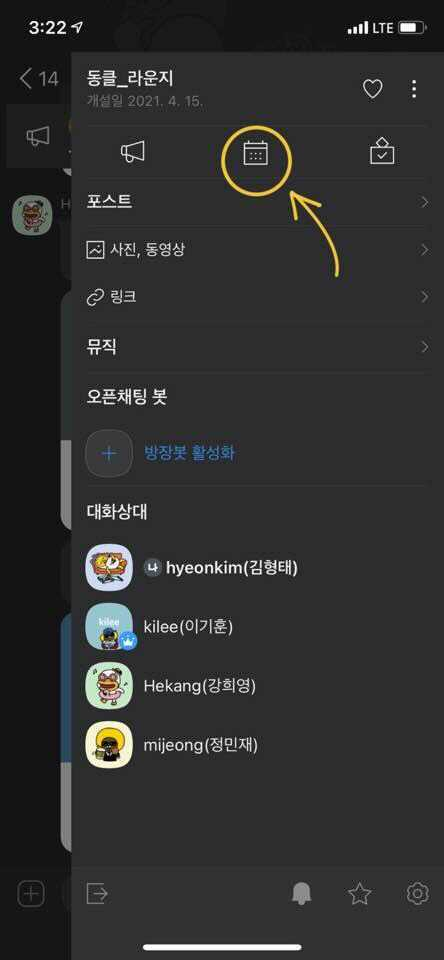
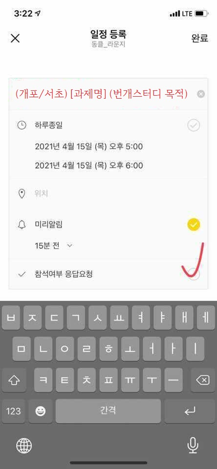
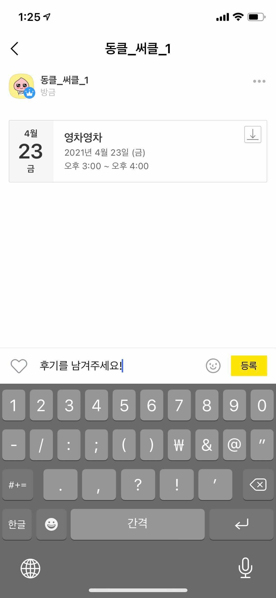

### 📃 세션은 아래과 같이 열어주세요.

1. 카카오톡 화면 오른쪽 위 설정버튼 클릭

2. 캘린터 클릭

3. 일정 등록 클릭

4. 일정 등록

---

### 📃 일정은 다음과 같이 등록해주세요.

1. **(개포/서초)[과제명]세션 목적**
 
 >ex. (개포)[ft_services]yaml 파일 작성하는 법 같이 공부하실 분~
 
2. 참석여부 응답요청도 체크해주세요!

---

### 📃세션 후에는 참여한 세션의 후기를 남겨주세요.

1. 세션을 열 때와 마찬가지로 카카오톡 설정탭의 캘린더를 클릭하면, 참여한 세션에 댓글을 달 수 있습니다! 

