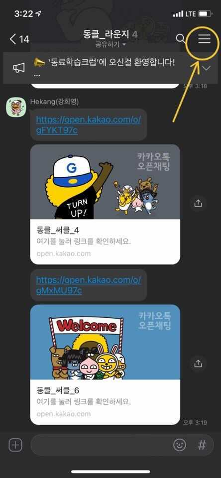

### 📃 세션은 아래과 같이 열어주세요.

1. 카카오톡 화면 오른쪽 위 설정버튼 클릭

2. 캘린터 클릭

3. 일정 등록 클릭

4. 일정 등록

---

### 📃 일정은 다음과 같이 등록해주세요.

1. **(개포/서초)[과제명]세션 목적**
 
 >ex. (개포)[ft_services]yaml 파일 작성하는 법 같이 공부하실 분~
 
2. 참석여부 응답요청도 체크해주세요!

---

### 📃세션 후에는 참여한 세션의 후기를 남겨주세요.

번개스터디가 끝나면, 아래의 구글폼에 접속해서 후기를 남겨주세요!

https://forms.gle/7Rj1vCQjhzxgNo5d9
